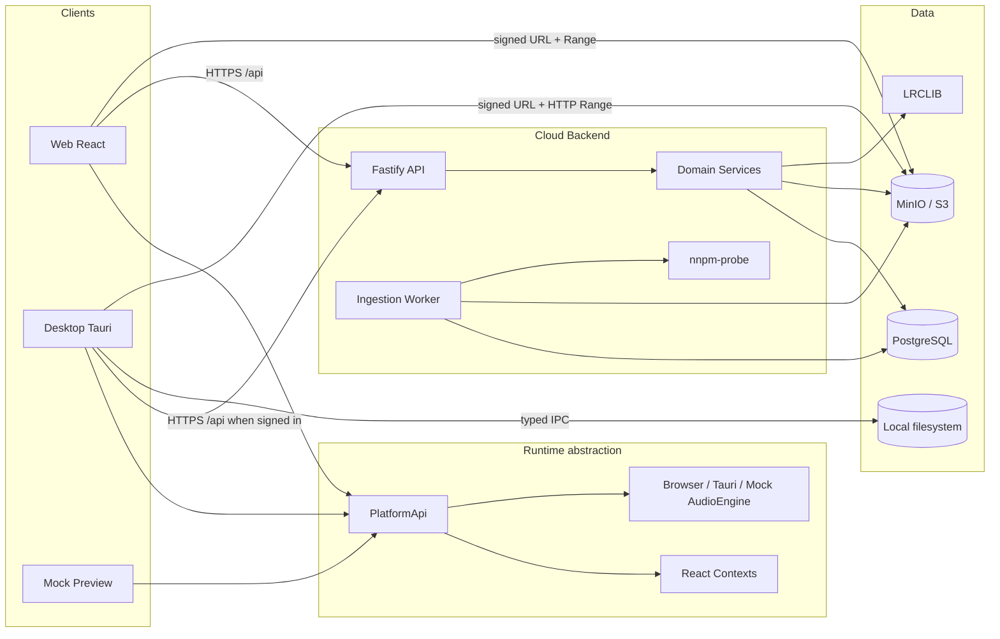
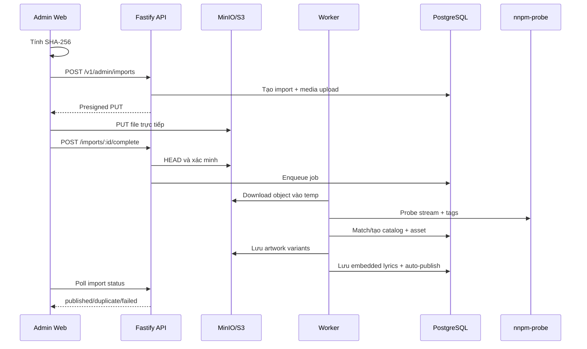
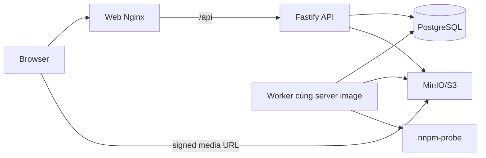

# Kiến trúc dự án Nghe Nhạc Pro Max

> Tài liệu tổng hợp cho Web, Desktop/Tauri, Cloud API, PostgreSQL, MinIO, ingestion worker và định hướng hybrid local + cloud.
>
> Cập nhật theo source ngày 2026-09-02. Source code và migration là nguồn sự thật cuối cùng về hành vi đang chạy.

## 1. Quy ước trạng thái

| Ký hiệu | Ý nghĩa |
| --- | --- |
| ✅ | Đã có trong source hiện tại |
| 🟡 | Đã có một phần hoặc còn compatibility cũ |
| 🔜 | Kiến trúc mục tiêu đã thống nhất nhưng chưa triển khai đầy đủ |
| ⛔ | Không thuộc phạm vi hiện tại |

## 2. Mục tiêu và nguyên tắc

Nghe Nhạc Pro Max hướng đến hệ sinh thái nghe nhạc chất lượng cao tương tự Qobuz, Tidal hoặc Spotify nhưng vẫn giữ thế mạnh phát nhạc local của Desktop.

- Web là môi trường cloud, có tài khoản, catalog chung và streaming bằng signed URL.
- Desktop là môi trường local-first, phát file local bằng native audio engine.
- Desktop mục tiêu hỗ trợ hybrid: local + cloud trong cùng thư viện.
- MinIO/S3 lưu audio và artwork; PostgreSQL lưu metadata và nghiệp vụ.
- Audio bytes không đi qua Fastify trong upload hoặc playback bình thường.
- Lossless/Hi-Res được giữ nguyên; pipeline hiện tại không tự transcode.
- Admin chỉ chọn file; server tự đọc metadata, tạo catalog và xuất bản.
- Dữ liệu portable của người dùng mục tiêu được đồng bộ theo tài khoản.
- Cấu hình phần cứng và filesystem vẫn thuộc từng thiết bị.

## 3. Sơ đồ tổng thể



## 4. Cấu trúc repository

```text
nghenhacpromax/
├── .github/workflows/ci.yml       # CI integration, E2E, container gates
├── infra/                         # PostgreSQL/MinIO compose và smoke stack
├── server/
│   ├── migrations/                # PostgreSQL migrations 001..015
│   ├── scripts/                   # migrate, role, storage, smoke, reconcile
│   ├── src/
│   │   ├── admin/                 # RBAC catalog, upload/import, auto-publish
│   │   ├── auth/                  # register/login/refresh/logout
│   │   ├── catalog/               # search và catalog read model
│   │   ├── ingestion/             # worker, nnpm-probe, artwork, lyrics, checksum
│   │   ├── library/               # cloud library và change cursor
│   │   ├── playlists|favorites|history|lyrics/
│   │   ├── storage/               # S3 signer/bootstrap/CORS
│   │   └── streaming/             # asset policy và signed URL
│   └── Dockerfile
├── crates/
│   ├── nnpm-audio-core/           # Probe, decode, DSD, MQA detect, DSP, WASM
│   └── nnpm-probe/                # CLI JSON metadata
├── src-tauri/                     # Rust/Tauri desktop và native audio
├── web/
│   ├── src/
│   │   ├── admin/                 # browser checksum và direct object upload
│   │   ├── api/                   # CloudApiClient
│   │   ├── audio/                 # Browser/Tauri/Mock engines
│   │   ├── auth/                  # AuthSessionController
│   │   ├── components/            # UI, player, auth, admin, views
│   │   ├── context/               # React orchestration
│   │   ├── platform/              # contracts và runtime adapters
│   │   ├── services/              # lyrics, artwork, presentation helpers
│   │   └── tests/
│   ├── Dockerfile
│   └── nginx.conf
├── ARCHITECTURE.md
├── README.md
└── package.json
```

## 5. Runtime frontend

`PlatformApi` là biên runtime chung. React không gọi trực tiếp Tauri IPC hoặc cloud fetch cho domain đã migrate.

| Khả năng | Web | Tauri hiện tại | Mock |
| --- | --- | --- | --- |
| Account | ✅ | ✅ optional | Không |
| Cloud API | ✅ | ✅ | Không |
| Quét thư mục local | Không | ✅ | Không |
| Native audio | Không | ✅ | Không |
| Cloud playback | ✅ | ✅ HTTP Range | Không |
| Native window chrome | Không | ✅ | Không |
| Catalog admin | ✅ | Không | Không |
| Backup database | Không | 🟡 hiện còn | 🟡 hiện còn |
| Autostart | Không | ✅ | Mock |
| Discord presence | Không | ✅ | Không |

### 5.1 Platform contracts

`PlatformApi` hiện có các domain: `library`, `playlists`, `favorites`, `history`, `lyrics`, `audioConfiguration`, `audioEngine`, `presence`, `window`, `themeAssets`, `artworkAssets`, `backup`, `autostart`, `account`, `cloud` và `admin`.

- Web dùng `CloudApiClient` và các `Web*Api`.
- Tauri: quét filesystem qua IPC; catalog/playlist/favorites/history khi đăng nhập qua REST (PostgreSQL). Desktop không bao giờ mở kết nối PostgreSQL.
- Mock dùng một `MockRuntime` chia sẻ `MockDataStore` và `MockEventBus`.
- `commands` chỉ là compatibility gateway; domain mới không được phụ thuộc trực tiếp vào nó.

### 5.2 Provider tree

```text
ErrorBoundary
└── PlatformProvider
    └── ToastProvider
        └── SettingsProvider
            └── AuthProvider
                └── AdminCapabilitiesProvider
                    └── AuthGate
                        └── LibraryProvider
                            └── PlaylistProvider
                                └── PlayerProvider
                                    └── AppShell
```

`SettingsProvider` nằm ngoài `AuthGate` để theme/font áp dụng trên màn hình đăng nhập. Library, playlist và player chỉ mount sau khi Web xác thực.

## 6. Xác thực và session

### Web — ✅

- Register, login, refresh, logout tại `/v1/auth/*`.
- Password hash bằng Argon2id.
- Access JWT ngắn hạn chỉ giữ trong memory.
- Refresh token được hash SHA-256 trong PostgreSQL và lưu bằng HttpOnly cookie.
- Rotate refresh mỗi lần dùng; reuse sau rotate revoke cả family.
- Nhiều request 401 dùng chung một refresh promise và retry đúng một lần.
- Không retry 403 và không refresh đệ quy trên auth endpoints.
- BroadcastChannel chỉ phát session event, không gửi token.

### Desktop — ✅ optional account

Tauri có `account=true`, `accountRequired=false`. Không bắt login để nghe local. Session cloud dùng cùng cookie refresh như web. Playlist, favorites, history theo tài khoản đi REST → PostgreSQL, không qua SQLite.

## 7. Backend cloud

### 7.1 Stack và phân tầng

- Node.js 20+, TypeScript, Fastify 5, TypeBox/AJV.
- PostgreSQL, `jose`, Argon2id.
- AWS SDK S3 signer, MinIO local.
- `sharp` xử lý artwork; `nnpm-probe` đọc audio.

```text
Route + schema + auth/RBAC
→ Domain service
→ Repository
→ PostgreSQL / ObjectStorageSigner / provider
```

### 7.2 Endpoint groups

| Domain | Endpoint chính | Trạng thái |
| --- | --- | --- |
| Health | `/health/live`, `/health/ready` | ✅ |
| Auth | `/v1/auth/register|login|refresh|logout` | ✅ |
| User | `GET/PATCH /v1/me` | ✅ |
| Catalog | search, published track list, stats, track/album/artist detail | ✅ |
| Library | tracks, stats, changes, add/remove | ✅ |
| Playlists | CRUD, membership, reorder | ✅ |
| Favorites | track, album, artist | ✅ |
| History | list, record, clear | ✅ |
| Lyrics | stored lyrics và remote resolve | ✅ |
| Streaming | `POST /v1/tracks/:trackId/stream` | ✅ |
| Admin legacy | manual artist/album/track draft | 🟡 |
| Admin import | create/list/complete/retry/reconcile | ✅ |
| Preferences | `GET/PUT /v1/me/preferences` | ✅ |

OpenAPI (`/docs`, `/docs/openapi.json`) bật khi `DOCS_ENABLED` (mặc định tắt ở `NODE_ENV=production`).

## 8. PostgreSQL data model

### 8.1 Identity và RBAC

- `users`
- `user_profiles`
- `refresh_sessions`
- `user_roles`

### 8.2 Catalog

- `artists`
- `albums`
- `tracks`
- `track_artists`
- `audio_assets`
- `artwork_assets`
- `track_lyrics`

Identifier dùng cho matching tự động:

- Artist: MusicBrainz Artist ID.
- Album: MusicBrainz Album ID, UPC.
- Track: ISRC, MusicBrainz Track ID.
- Asset: checksum và storage key.

### 8.3 Dữ liệu theo tài khoản

- `user_library_tracks`
- `library_changes`
- `playlists`
- `playlist_tracks`
- `user_favorite_tracks`
- `user_favorite_albums`
- `user_favorite_artists`
- `play_history`

Mọi query user-owned phải lấy `user_id` từ JWT, không nhận user ID tùy ý từ client.

### 8.4 Ingestion và quản trị

- `media_uploads`
- `ingestion_jobs`
- `audio_imports`
- `admin_audit_log`
- `track_rights` (legacy compatibility)

### 8.5 Migration map

| Migration | Nội dung |
| --- | --- |
| `001_identity` | User, profile, refresh session |
| `002_catalog` | Artist, album, track, asset, search index |
| `003_library` | User library và change cursor |
| `004_user_music_domains` | Playlist, favorites, history, lyrics |
| `005_rbac` | User roles |
| `006_ingestion` | Upload, worker job, audit, artwork, publication |
| `007_observability` | Request correlation cho ingestion |
| `008_audio_imports` | Upload-first staging imports |
| `009_zero_input_imports` | Identifier matching, placeholder, duplicate status |
| `010_artist_image` | Ảnh nghệ sĩ |
| `011_clear_album_covers_on_artists` | Gỡ nhầm cover album trên artist |
| `012_identity_preferences_assets` | `user_preferences` + asset/identity fields |
| `013_refresh_plain_lrclib_lyrics` | Refresh lyrics LRCLIB |
| `014_mqa_dsd1024` | MQA / DSD1024 catalog fields |
| `015_refresh_rotation_fencing` | Unique index fencing refresh rotate |

### 8.6 Preferences — ✅

Bảng `user_preferences` (migration 012): `user_id`, `schema_version`, `preferences_json`, `revision`. API `GET/PUT /v1/me/preferences` dùng allowlist server-side. Không đưa local path, device ID hoặc signed URL vào preferences cloud. Theme/EQ portable hydrate từ `AuthContext`; Backup JSON Desktop chỉ hiện khi chưa đăng nhập.

## 9. Object storage

### 9.1 Vai trò

- Bucket audio private lưu FLAC, WAV, ALAC, MP3, DSF, DFF và asset gốc.
- Bucket artwork public-read lưu artwork variants đã xử lý.
- PostgreSQL không lưu audio bytes.
- MinIO không lưu nghiệp vụ tài khoản.
- Signed URL không được lưu database.

MinIO dùng cho local/dev; production có thể thay bằng Amazon S3, Cloudflare R2 hoặc S3-compatible storage.

### 9.2 Upload

```text
Browser chọn file local
→ tính SHA-256
→ API tạo audio_import + presigned PUT
→ Browser PUT trực tiếp vào MinIO
→ API HEAD/checksum xác minh
→ tạo ingestion job
```

Audio bytes không đi qua Fastify. Upload limit có cấu hình và mặc định hiện tại là 1 GiB.

### 9.3 Streaming

```text
Client yêu cầu stream descriptor
→ API kiểm tra JWT và catalog
→ chọn audio asset
→ ký URL GET ngắn hạn
→ Client đọc trực tiếp từ MinIO bằng HTTP Range
```

MinIO/S3 phải hỗ trợ `Range`, `Content-Range`, `Accept-Ranges` và CORS phù hợp.

## 10. Zero-input Admin ingestion — ✅

Admin UI chỉ yêu cầu chọn hoặc kéo thả file. Concurrency upload hiện là 3.



### 10.1 Import states

```text
waiting_upload → uploading → verifying → probing → publishing
                                              ├── published
                                              ├── duplicate
                                              └── failed
cancelled có thể xảy ra trước khi hoàn tất
```

`needs_review` và `ready` vẫn còn trong contract compatibility nhưng zero-input path bình thường không yêu cầu Admin review.

### 10.2 Metadata tự đọc

Worker đọc và chuẩn hóa:

- Title, artist, album artist, album.
- Genre, date/year, track/disc và tổng số.
- Composer, label, copyright, BPM.
- ISRC, UPC, MusicBrainz IDs.
- ReplayGain.
- Duration, codec, container, bitrate.
- Sample rate, bit depth, channels/layout.
- Lossless, Hi-Res, DSD.
- Embedded artwork.
- Embedded synchronized/plain lyrics.

Fallback:

```text
title        = tag TITLE hoặc tên file
artist       = tag ARTIST, album artist hoặc Nghệ sĩ không xác định
album_artist = tag ALBUMARTIST hoặc artist
album        = tag ALBUM hoặc Album không xác định
cover        = embedded artwork hoặc placeholder UI
```

### 10.3 Matching và idempotency

- Artist: MusicBrainz Artist ID, sau đó exact normalized name.
- Album: MusicBrainz Album ID, UPC, sau đó normalized artist + title + year.
- Track: ISRC, MusicBrainz Track ID, metadata tuple, sau đó checksum.
- Audio asset: checksum/storage key.
- Không fuzzy-merge artist hoặc album.
- Unknown artist/album dùng placeholder chung.
- Upload/import retry và double-click không được tạo duplicate.

### 10.4 Reconcile object có sẵn

`POST /v1/admin/imports/reconcile` và script reconcile quét prefix allowlist, tìm object audio chưa liên kết và tạo import staging. Browser không nhận MinIO credential.

Object tải trực tiếp bằng MinIO Console chỉ xuất hiện trong catalog sau khi reconcile/import hoàn tất.

### 10.5 Legacy admin — 🟡

Source vẫn giữ manual draft routes, `AdminAdvancedDraft`, rights types và publish path cũ để compatibility. UI mặc định đã là zero-input; auto-publish không yêu cầu rights. Legacy chỉ nên được thu hẹp ở phase riêng sau khi integration ổn định.

## 11. Audio playback

### 11.1 Web — ✅

`BrowserAudioEngine`:

- Decode bằng WASM `nnpm-audio-core` (`CorePlaybackSession`), không `HTMLAudioElement`.
- Queue thuộc `PlayerContext` (`queueOwnership=client`).
- Xin signed stream descriptor theo track ID; quality hiện luôn `maximum`.
- FLAC/PCM I/O là HTTP Range (`HttpRangeSource` / `RandomAccessSource`). WASM decoder đọc bằng `Read + Seek`, không nhận `&[u8]` toàn file.
- Compressed window ~256 KiB–1 MiB; PCM ring 4–8 giây (low-water 3s). Seek là epoch mới: abort Range cũ, giữ header, Range tại seek point.
- Signed URL refresh qua `urlProvider` khi 401/403; không đóng cứng một URL cho cả bài.
- Server trả 200 cho Range trên object lớn → fail `RANGE_REQUIRED`, không tải hi-res.
- 256 MiB chỉ còn ở `BoundedWholeFileFallback` (DST / codec chưa random-access).
- Signed URL chỉ giữ trong memory.
- Chuẩn hóa autoplay, network, format và playback errors.

### 11.2 Quality policy — 🟡 selector còn, biên stream luôn `maximum`

`assetSelector` vẫn hiểu max/lossless/high/auto. `POST /v1/tracks/:id/stream` và client (`getQuality: () => 'maximum'`, `normalizeStreamingQuality`) hiện luôn chọn asset fidelity cao nhất. Không transcode.

### 11.3 Desktop hiện tại — ✅ local + hybrid tùy chọn

`TauriAudioEngine` dùng typed IPC. Queue do Rust engine sở hữu để hỗ trợ gapless và auto-advance. `audioConfiguration` quản lý output device, ASIO, playback mode, EQ, crossfade, ReplayGain và exclusive mode.

Desktop decode đi qua `nnpm-audio-core` (Symphonia/Lofty/Rubato, `NdsdSourceAdapter`, `OutputRouter`). WASAPI/ASIO/DoP vẫn thuộc app. Web dùng WASM của cùng crate (`wasm` + `dst-rust`) và Web Audio PCM. Worker ingestion dùng CLI `nnpm-probe`.

`TauriPlatform`: `account=true`, `accountRequired=false`, `cloudApi=true`, `remotePlayback=true`. IPC filesystem path phải nằm trong library root, track đã index, hoặc path vừa chọn bằng dialog native.

### 11.4 Desktop hybrid — ✅ catalog merge + signed URL; 🔜 offline cache

```ts
type PlayableSource =
  | { kind: 'local'; path: string }
  | { kind: 'cloud'; trackId: string; url: string; expiresAt: string }
  | { kind: 'offline'; trackId: string; cachedPath: string };
```

Nguồn phát ưu tiên:

```text
có local asset hợp lệ → phát local
không có local        → xin signed cloud URL
offline               → chưa có cache kind
```

Ghép local/cloud hiện theo metadata tuple + duration ≤ 2s; checksum/ISRC/MBID vẫn 🔜.

Hybrid desktop: `account=true`, `accountRequired=false`, `cloudApi=true`, `remotePlayback=true`, `adminCatalog=false`. Catalog merge và native MinIO playback đã nối. Playlist/favorites/history theo tài khoản đi REST, không SQLite. IPC path ngoài library/dialog bị từ chối.

## 12. Library và user music domains

### Web

- Library, playlists, favorites và history dùng cloud APIs.
- Dữ liệu được cô lập theo JWT user.
- Library changes dùng cursor opaque từ `change_id` monotonic.
- History hỗ trợ `client_request_id` để retry không duplicate.

### Desktop hiện tại

- Library quét local filesystem; index đường dẫn vẫn local (SQLite scan index, không phải DB nghiệp vụ).
- Khi đăng nhập: playlist, favorites, history, lyrics resolve dùng cloud APIs → PostgreSQL.
- Khi chưa đăng nhập: playlist/favorites/history cloud rỗng; vẫn nghe file local.
- Local path không được gửi lên cloud.
- Desktop/Web không kết nối PostgreSQL. Chỉ server được mở pool.

### Hybrid mục tiêu

- Một track có nguồn `local`, `cloud` hoặc `local + cloud`.
- Ghép nguồn theo checksum, ISRC, MusicBrainz ID (🔜); hiện tại exact metadata tuple + duration ≤ 2s.
- Playlist, favorites, history và portable preferences dùng account khi đăng nhập.
- Local path không được gửi lên cloud.

## 13. Lyrics và artwork

Lyrics lookup:

```text
stored/local backend
→ embedded track lyrics
→ LRCLIB/cloud resolve
→ not found
```

- Embedded lyrics từ ingestion được lưu với provider `embedded`.
- Positive và negative cache có TTL riêng.
- Instrumental là trạng thái dữ liệu, không phải lỗi.
- LRCLIB search ranks candidates as: synced + track language, synced + other language, plain + track language, then plain + other. Track language comes from tags when present, otherwise from title/artist/album script or genre.
- Romanization, translation và presentation vẫn ở frontend.
- Tauri local path chỉ được convert trong desktop artwork adapter.
- Web không gửi filesystem path lên cloud.
- Embedded artwork được trích xuất, tạo variants và lưu artwork bucket.
- Lỗi artwork/lyrics không làm audio import hợp lệ thất bại.

## 14. Dữ liệu tài khoản và settings

### 14.1 Hiện tại

| Dữ liệu | Web | Desktop |
| --- | --- | --- |
| Profile | Cloud account | Cloud account (optional) |
| Library catalog | PostgreSQL theo user | Merge local scan index + catalog API |
| Playlist | PostgreSQL theo user | REST → PostgreSQL khi đăng nhập |
| Favorites | PostgreSQL theo user | REST → PostgreSQL khi đăng nhập |
| History | PostgreSQL theo user | REST → PostgreSQL khi đăng nhập (chỉ track có `cloudTrackId`) |
| Theme/EQ/preferences | Cloud preferences + local | Local device; portable cloud khi đăng nhập |
| Backup JSON | Web disabled | Chỉ khi chưa đăng nhập (scan-index dump) |

### 14.2 Portable preferences — ✅

Portable preferences lưu theo tài khoản:

- Theme, language, font và UI preferences.
- User EQ presets.
- Playback preferences có thể dùng chung.
- Crossfade và ReplayGain preference.

Device-only settings vẫn local:

- Local library roots và filesystem paths.
- Audio output device và ASIO driver.
- Exclusive mode theo thiết bị.
- Autostart, window size/position.
- Cache/offline download path và system volume.

### 14.3 Source of truth — PostgreSQL trên server

PostgreSQL là source of truth duy nhất cho dữ liệu nghiệp vụ. Desktop và Web chỉ nói chuyện REST/API. Không thay SQLite bằng Postgres driver trên máy người dùng.

Lưu trên PostgreSQL: users, roles, catalog (artists/albums/tracks), playlist, favorites, listening history, lyrics cache, ingestion/RBAC.

Giữ trên máy: library roots và filesystem path, trạng thái audio engine / WASAPI, output device, window/autostart. Có thể là SQLite scan index hoặc JSON — không phải DB nghiệp vụ.

## 15. Security boundaries

- Không lưu access token trong localStorage/sessionStorage.
- Refresh cookie HttpOnly; production dùng Secure.
- Access JWT gắn `sid`; authenticate từ chối session đã revoke/logout.
- CORS dùng origin allowlist, không wildcard khi có cookie.
- Admin routes bắt buộc `catalog_admin`.
- User-owned SQL luôn filter `user_id` từ JWT.
- Browser không nhận S3/MinIO credential hoặc storage key nội bộ.
- Audio bucket private; artwork bucket public-read theo policy.
- Signed URL có TTL 60–300 giây và không lưu database.
- Upload xác minh size và SHA-256 trước khi enqueue job (HEAD hoặc hash object).
- Logger redact bearer token, cookie và presigned URL.
- API có request ID, security headers, rate limit auth/stream/reconcile.
- Production từ chối JWT mặc định và credential MinIO `minioadmin`.
- Container server/web chạy non-root.
- Reconcile chỉ quét `IMPORT_RECONCILE_PREFIXES` khác rỗng; không quét cả bucket.

## 16. Local development

| Dịch vụ | Địa chỉ mặc định |
| --- | --- |
| Web Vite | `http://127.0.0.1:1420` |
| Cloud API | `http://127.0.0.1:3001` |
| OpenAPI | `http://127.0.0.1:3001/docs` |
| PostgreSQL project | `127.0.0.1:5433` |
| MinIO API | `http://127.0.0.1:9000` |
| MinIO Console | `http://127.0.0.1:9001` |

Thứ tự khởi động:

```text
PostgreSQL
→ MinIO + buckets/CORS
→ migrations
→ API
→ ingestion worker
→ Web
```

`server/.env`, `web/.env`, `.local/`, media test và log không được commit.

## 17. Container topology



- Server image dùng Node 20, có `nnpm-probe` (Rust) và chạy UID 10001.
- Worker dùng cùng server image với command khác.
- Web build bằng Vite và phục vụ bởi Nginx non-root.
- Nginx reverse proxy `/api`, rewrite refresh cookie path và đặt CSP.
- API có live/ready health; worker có heartbeat health.

## 18. Testing và CI

Workflow `.github/workflows/ci.yml` định nghĩa:

1. PostgreSQL service thật.
2. MinIO thật.
3. nnpm-probe thật.
4. Migration.
5. Server typecheck/build/integration tests.
6. Summary bắt buộc:

```text
PostgreSQL integration: PASS (15 suites)
S3 integration: PASS
nnpm-probe integration: PASS
```

7. Web typecheck/tests/build.
8. API E2E smoke.
9. Server/web container build.
10. Non-root, nnpm-probe và reverse proxy container smoke.

Required integration path không được dùng `continue-on-error`, fake signer/probe hoặc skip.

Tài liệu này không tuyên bố CI xanh. Chỉ GitHub Actions run thật trên commit cụ thể mới là bằng chứng CI.

## 19. Trạng thái triển khai

### Đã triển khai

- ✅ Platform abstraction cho Web/Tauri/Mock.
- ✅ Web account và auth session.
- ✅ Cloud catalog, library, playlists, favorites, history, lyrics.
- ✅ Signed streaming và BrowserAudioEngine (WASM Range I/O cho FLAC/PCM).
- ✅ PostgreSQL migrations 001–015.
- ✅ MinIO/S3 storage abstraction.
- ✅ Zero-input multi-file Admin upload.
- ✅ nnpm-probe metadata, classification, embedded artwork/lyrics.
- ✅ Automatic matching, placeholders, checksum dedupe và auto-publish.
- ✅ Reconcile object MinIO theo prefix allowlist.
- ✅ RBAC catalog admin và audit log.
- ✅ Preferences cloud (`/v1/me/preferences`) và hydrate client.
- ✅ Desktop optional account, hybrid catalog, native signed-URL playback.
- ✅ Dockerfiles, compose smoke và CI workflow.

### Chưa hoàn tất hoặc còn compatibility

- 🟡 Manual admin draft, rights types/routes và `AdminAdvancedDraft` vẫn còn (file, không gắn UI).
- 🟡 Backup API/adapters còn cho Desktop khi chưa đăng nhập.
- 🟡 Merge local/cloud chưa dùng checksum/ISRC/MBID.
- 🟡 Stream quality policy chưa nối ra biên HTTP (luôn maximum).
- 🟡 Offline cache chưa có.
- 🟡 CI cần run thật trên commit cụ thể mới là bằng chứng xanh.

### Thứ tự phase tiếp theo

1. Xác nhận CI GitHub Actions xanh sau gate `NNPM_PROBE_REQUIRED` và container `/health/ready`.
2. Thu hẹp legacy Admin manual/rights và gỡ `AdminAdvancedDraft`.
3. Merge hybrid theo checksum/ISRC/MusicBrainz.
4. Web FLAC/PCM Range đã là kiến trúc chuẩn; quality presets chỉ mở lại sau khi integration/CI ổn định.
5. Offline cache, Media Session, PWA vẫn non-goal đến khi CI/integration ổn định.

## 20. Quyết định kiến trúc bắt buộc giữ

1. Không đưa audio bytes qua Fastify trong upload/playback bình thường.
2. Không lưu signed URL hoặc S3 credential trong PostgreSQL/browser storage.
3. Không gửi local filesystem path lên cloud.
4. Không dùng `path` để giả làm cloud URL trong Desktop hybrid.
5. Không tạo audio engine thứ hai trong cùng runtime.
6. Queue ownership rõ ràng: Rust engine trên Tauri, `PlayerContext` trên Web/Mock.
7. Output device/ASIO/EQ thuộc `audioConfiguration`, không thuộc transport engine.
8. Admin zero-input phải server-side probe; không tin browser metadata.
9. Retry upload/import/history phải idempotent.
10. Artwork/lyrics lỗi không được làm hỏng audio hợp lệ.
11. User data phải cô lập bằng JWT `user_id`.
12. Device-only settings không được đồng bộ cloud.
13. Không xóa compatibility lớn trước khi có test và migration path.
14. Không tuyên bố integration/CI xanh nếu chưa có bằng chứng thật.
15. Web FLAC/PCM không được slurp object vào RAM/WASM; I/O chuẩn là HTTP Range + decoder `Read + Seek`. 256 MiB chỉ cho bounded fallback của codec chưa random-access.

## 21. Lệnh kiểm tra chuẩn

```text
npm run server:typecheck
npm run server:test
npm run server:build
npm run typecheck
npm test -- --run
npm run build
git diff --check
```

Khi chạy required integration, PostgreSQL, MinIO và nnpm-probe phải là dịch vụ thật và các required flags của server test phải được bật.

## 22. Non-goals hiện tại

- Không Media Session trước khi CI/integration ổn định.
- Không PWA trước khi CI/integration ổn định.
- Không transcode/CDN pipeline trong phase hiện tại.
- Không deploy hoặc push container image như một phần của refactor local.
- Không bắt Desktop đăng nhập để phát thư viện local.
